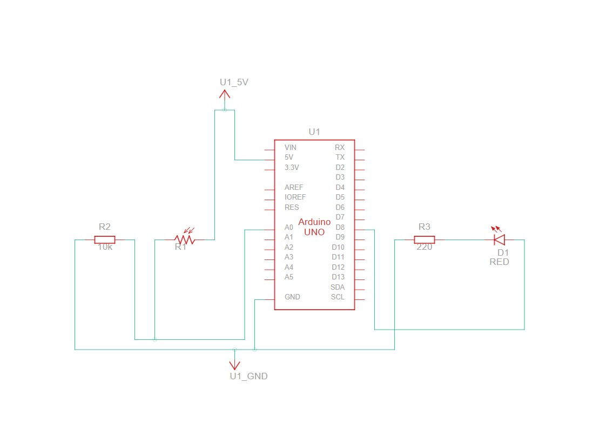

# **Projet Arduino : Contrôle d'une LED avec une Photorésistance (LDR)**  

## **Description**  
Ce projet utilise une photorésistance (LDR) pour détecter l'intensité lumineuse ambiante et allumer une LED si la lumière est insuffisante.  

----

## **Matériel nécessaire**  
- Carte Arduino (Uno, Nano, etc.)  
- Photorésistance (LDR)  
- Résistance 10kΩ (pour le pont diviseur de tension)  
- LED  
- Résistance 220Ω (pour la LED)  
- Breadboard et fils de connexion  

---

## **Schéma de montage**  
1. **LDR** :  
   - Une broche → **5V**  
   - Autre broche → **A0** + **résistance 10kΩ** → **GND**.  
2. **LED** :  
   - Anode (+) → **broche 8** via résistance 220Ω.  
   - Cathode (-) → **GND**.  

---

## **Fonctionnement du code**  
1. Lecture de la LDR (`A0`) et affichage dans le **moniteur série**.  
2. Si `valeurLDR < seuil (400)` → LED allumée (sombre).  
3. Sinon → LED éteinte.  

---

## **Paramètres ajustables**  
- `seuil = 400` : Ajuster la sensibilité.  
- `delay(500)` : Modifier la fréquence des lectures.  

---

## **Auteur** :
#### [Harouna Traoré](https://github.com/HarounaTraore)
